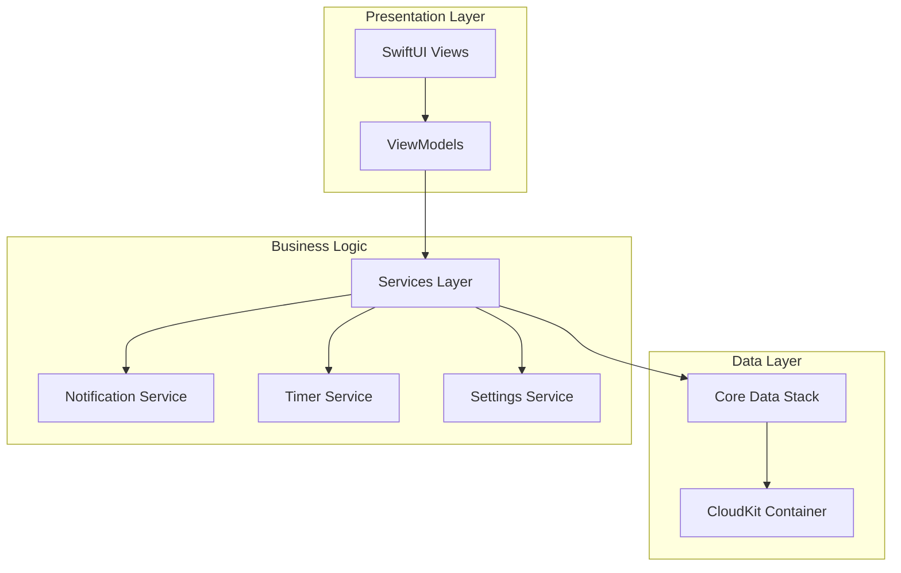

# Design Document

## Overview

AHappyCoderDay Todo List 是一款原生 macOS 应用，采用 SwiftUI 框架开发，遵循 macOS Human Interface Guidelines。应用采用现代化的架构模式，提供流畅的用户体验和强大的功能。

### 技术栈选择
- **UI框架**: SwiftUI (iOS 14.0+, macOS 11.0+)
- **数据持久化**: Core Data + CloudKit (支持 iCloud 同步)
- **通知系统**: UserNotifications framework
- **计时器**: Combine framework + Timer
- **架构模式**: MVVM (Model-View-ViewModel)

## Architecture

### 整体架构



### 模块划分

1. **Presentation Layer (表现层)**
   - SwiftUI Views: 用户界面组件
   - ViewModels: 视图状态管理和业务逻辑

2. **Business Logic Layer (业务逻辑层)**
   - TaskService: 任务管理服务
   - NotificationService: 通知管理服务
   - TimerService: 番茄工作法计时服务
   - SettingsService: 应用设置服务

3. **Data Layer (数据层)**
   - Core Data Stack: 本地数据存储
   - CloudKit Integration: 云端同步

## Components and Interfaces

### 核心组件

#### 1. MainWindowView
主窗口视图，包含侧边栏和主内容区域。

```swift
struct MainWindowView: View {
    @StateObject private var taskViewModel = TaskViewModel()
    @State private var selectedCategory: TaskCategory = .work
    
    var body: some View {
        NavigationSplitView {
            SidebarView(selectedCategory: $selectedCategory)
        } detail: {
            TaskListView(category: selectedCategory)
        }
    }
}
```

#### 2. SidebarView
侧边栏显示四个主要类别和统计信息。

```swift
struct SidebarView: View {
    @Binding var selectedCategory: TaskCategory
    @StateObject private var statisticsViewModel = StatisticsViewModel()
    
    // 显示工作篇、健康篇、生活篇、心灵篇四个类别
    // 显示每日完成进度
}
```

#### 3. TaskListView
任务列表视图，支持拖拽排序和快速操作。

```swift
struct TaskListView: View {
    let category: TaskCategory
    @StateObject private var taskViewModel = TaskViewModel()
    @State private var showingAddTask = false
    
    // 任务列表展示
    // 支持拖拽重排序
    // 快速标记完成
}
```

#### 4. PomodoroTimerView
番茄工作法计时器组件。

```swift
struct PomodoroTimerView: View {
    @StateObject private var timerViewModel = PomodoroTimerViewModel()
    
    // 25分钟工作计时
    // 5分钟休息计时
    // 状态栏显示进度
}
```

### 数据模型

#### TaskCategory 枚举
```swift
enum TaskCategory: String, CaseIterable {
    case work = "工作篇"
    case health = "健康篇" 
    case life = "生活篇"
    case mind = "心灵篇"
    
    var icon: String {
        switch self {
        case .work: return "laptopcomputer"
        case .health: return "heart.fill"
        case .life: return "house.fill"
        case .mind: return "brain.head.profile"
        }
    }
}
```

#### Task 数据模型
```swift
@objc(Task)
public class Task: NSManagedObject {
    @NSManaged public var id: UUID
    @NSManaged public var title: String
    @NSManaged public var taskDescription: String?
    @NSManaged public var category: String
    @NSManaged public var isCompleted: Bool
    @NSManaged public var createdAt: Date
    @NSManaged public var completedAt: Date?
    @NSManaged public var estimatedMinutes: Int32
    @NSManaged public var priority: Int16
    @NSManaged public var reminderTime: Date?
    @NSManaged public var isRecurring: Bool
    @NSManaged public var recurringPattern: String?
}
```

#### TaskTemplate 模板模型
```swift
struct TaskTemplate {
    let id: UUID
    let name: String
    let category: TaskCategory
    let tasks: [TaskTemplateItem]
}

struct TaskTemplateItem {
    let title: String
    let description: String
    let estimatedMinutes: Int
}
```

## Data Models

### Core Data Schema

#### Task Entity
- id: UUID (Primary Key)
- title: String
- taskDescription: String (Optional)
- category: String
- isCompleted: Bool
- createdAt: Date
- completedAt: Date (Optional)
- estimatedMinutes: Int32
- priority: Int16
- reminderTime: Date (Optional)
- isRecurring: Bool
- recurringPattern: String (Optional)

#### Settings Entity
- id: UUID (Primary Key)
- pomodoroWorkMinutes: Int16 (默认25)
- pomodoroBreakMinutes: Int16 (默认5)
- enableNotifications: Bool
- quietHoursStart: Date (Optional)
- quietHoursEnd: Date (Optional)
- theme: String (light/dark/auto)

#### Statistics Entity
- id: UUID (Primary Key)
- date: Date
- completedTasks: Int16
- totalTasks: Int16
- pomodoroSessions: Int16
- category: String

### 预设任务模板

#### 代码仪式感模板
```swift
let codeRitualTemplate = TaskTemplate(
    name: "代码仪式感",
    category: .work,
    tasks: [
        TaskTemplateItem(title: "整理桌面和IDE界面", description: "清理桌面文件，整理IDE工作区", estimatedMinutes: 5),
        TaskTemplateItem(title: "为功能模块写诗意注释", description: "为今天要写的代码添加有趣的注释", estimatedMinutes: 10),
        TaskTemplateItem(title: "完成代码后的庆祝动作", description: "转笔一圈或其他小庆祝", estimatedMinutes: 1)
    ]
)
```

#### 健康法模板
```swift
let healthTemplate = TaskTemplate(
    name: "程序员健康法",
    category: .health,
    tasks: [
        TaskTemplateItem(title: "颈椎字母操", description: "用头部写A-Z字母", estimatedMinutes: 5),
        TaskTemplateItem(title: "站立工作1小时", description: "调整为站立式工作状态", estimatedMinutes: 60),
        TaskTemplateItem(title: "每小时喝水提醒", description: "设置喝水提醒", estimatedMinutes: 1)
    ]
)
```

## Error Handling

### 错误类型定义
```swift
enum AppError: LocalizedError {
    case coreDataError(Error)
    case notificationPermissionDenied
    case cloudKitSyncError(Error)
    case invalidTaskData
    case timerError
    
    var errorDescription: String? {
        switch self {
        case .coreDataError(let error):
            return "数据存储错误: \(error.localizedDescription)"
        case .notificationPermissionDenied:
            return "需要通知权限才能设置提醒"
        case .cloudKitSyncError(let error):
            return "iCloud同步失败: \(error.localizedDescription)"
        case .invalidTaskData:
            return "任务数据格式错误"
        case .timerError:
            return "计时器启动失败"
        }
    }
}
```

### 错误处理策略
1. **数据层错误**: 使用 Result 类型包装返回值，在 ViewModel 层处理
2. **网络同步错误**: 显示用户友好的错误信息，提供重试选项
3. **权限错误**: 引导用户到系统设置页面
4. **崩溃恢复**: 使用 Core Data 的自动恢复机制

## Testing Strategy

### 单元测试
- **ViewModels**: 测试业务逻辑和状态管理
- **Services**: 测试数据操作和业务规则
- **Models**: 测试数据验证和转换

### 集成测试
- **Core Data Stack**: 测试数据持久化和查询
- **CloudKit Sync**: 测试云端同步功能
- **Notification Service**: 测试通知发送和调度

### UI测试
- **主要用户流程**: 创建任务、标记完成、使用计时器
- **键盘快捷键**: 测试所有快捷键功能
- **窗口管理**: 测试窗口大小调整和状态保存

### 性能测试
- **大量任务处理**: 测试1000+任务的性能表现
- **内存使用**: 监控长时间运行的内存占用
- **启动时间**: 确保应用快速启动

### 测试工具
- XCTest framework
- SwiftUI Preview
- Instruments (性能分析)
- TestFlight (Beta测试)

## 用户界面设计

### 主窗口布局
- **最小窗口尺寸**: 800x600
- **默认窗口尺寸**: 1000x700
- **侧边栏宽度**: 250px (可调整)

### 颜色方案
- **主色调**: SF Blue (#007AFF)
- **成功色**: SF Green (#34C759)
- **警告色**: SF Orange (#FF9500)
- **错误色**: SF Red (#FF3B30)

### 字体
- **标题**: SF Pro Display
- **正文**: SF Pro Text
- **代码**: SF Mono

### 图标
使用 SF Symbols 系统图标，确保与 macOS 系统风格一致。